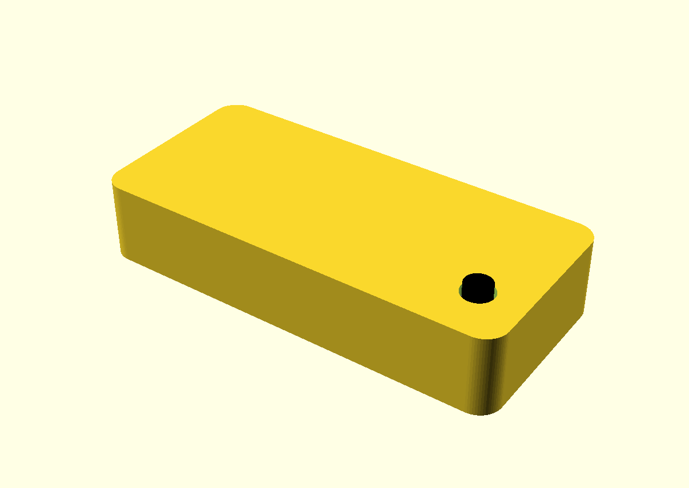
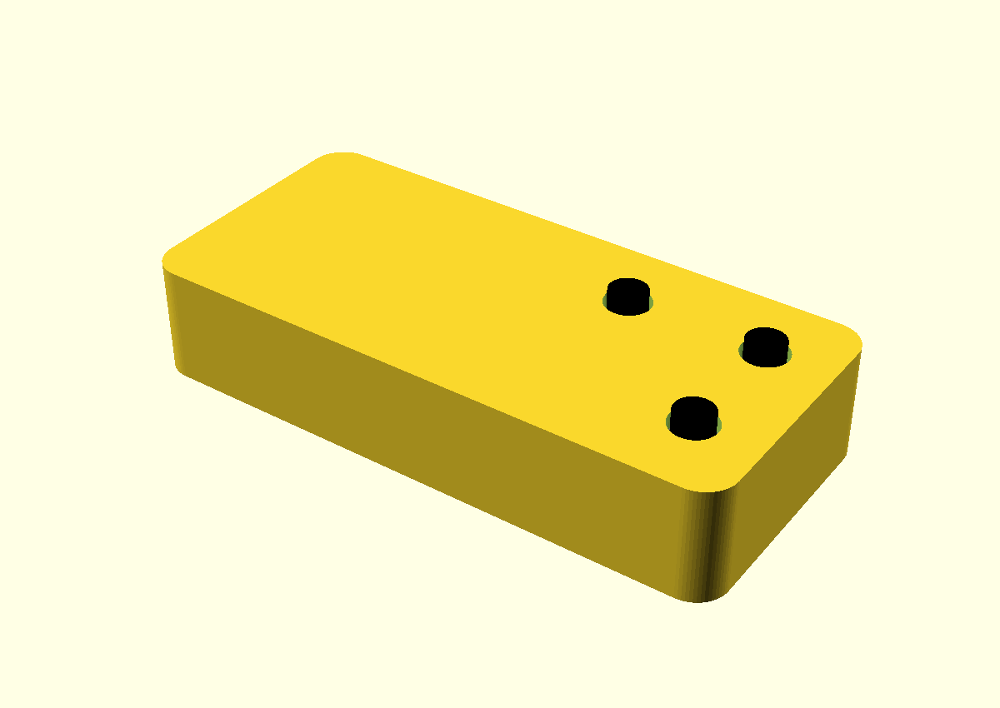

# Pico case with optional buttons

A two-part, snap-together printed case for a bare Raspberry Pi Pico, with
up to three 6x6mm tact switches soldered straight to the board. The lid
has an actuator hole for each switch you fit, an LED light window, and an
optional BOOTSEL poke-hole. A matching soldering jig holds each switch in
exactly the spot the lid expects while you solder it.

Case: 55.4 x 25.4 x 10.6 mm. Everything is parametric OpenSCAD; the
switch positions live in one file and are shared by the case and the jig.

| 1 button (GP15) | 2 buttons (GP15 + GP16) | 3 buttons (+ GP20) |
|---|---|---|
|  |  |  |

Rendered from the `assembled` view with a mock board, so the black dots
are the switch actuators standing 1.2mm proud of the lid. The USB
opening is at the far end.

## What is here

    pico_case.scad          base + lid, all parameters at the top
    pico_solder_jig.scad    soldering jig
    slots.inc               the button positions, read by both files
    code.py                 CircuitPython test: LED flashes on button press

    pico_case_base.stl                one base fits every button layout
    pico_case_lid.stl                 GP15 + GP16  (default)
    pico_case_lid_1button.stl         GP15 only
    pico_case_lid_3button.stl         GP15 + GP16 + GP20
    pico_solder_jig.stl               GP15 + GP16  (default)
    pico_solder_jig_1button.stl       GP15 only
    pico_solder_jig_3button.stl       GP15 + GP16 + GP20

    boardpic.png            photo used to calibrate the LED and BOOTSEL positions

## Bill of materials

- Raspberry Pi Pico, bare (no headers)
- One to three 6x6mm through-hole tact switches, **7mm overall height**
  (sold as "6x6x7mm tactile push button"). The height matters: the model
  asserts the actuator reaches through the lid. A 5mm switch will fail
  the check; a 9mm one sticks out further, which is fine. The legs come
  bent outward for surface soldering; you straighten them before fitting.

## Where the buttons can go

A 6x6 tact switch has its two opposite-pole legs 4.5mm apart, and two
Pico holes are 5.08mm apart. The legs flex the difference on their own,
so the switch just drops in. That means a switch can straddle any GND
pin and the GPIO two holes away from it, and the
Pico has thirteen such pairs. Only five of them have a 6x6mm footprint
clear of components; the other eight land on the LED, the BOOTSEL
button, a SOIC or passives.

    slot   pins     edge         notes
    GP12   18+16    pins 1-20    clear
    GP15   18+20    pins 1-20    clear  (default)
    GP20   28+26    pins 21-40   clear
    GP19   23+25    pins 21-40   clear
    GP16   23+21    pins 21-40   clear

Two switches on the same edge need their centres at least 6.4mm apart, so
GP12+GP15 and GP19+GP16 are mutually exclusive (they are 5.08mm apart and
their bodies would overlap). An assert catches it. **Three is the
maximum.**

Two pairs sit directly opposite each other, which looks tidiest:

    GP15 + GP16   47.09mm from the USB edge   <- recommended
    GP12 + GP19   42.01mm from the USB edge

GP15/GP16 land 5.64mm either side of the case centreline, so they are
symmetric about the case, not just the board. Their footprints cover only
DEBUG pads, vias and mounting holes: flat copper and bare holes, nothing
the switch body can foul.

### Why not more than three?

Mounting the board component side DOWN would put the switches on the bare
underside, freeing all thirteen GPIO pairs and allowing up to seven
buttons (four on the 1-20 edge, three on 21-40). The cost is that the
LED, BOOTSEL and the USB socket all end up facing the other way, so the
light window and USB cutout would have to move to the base, and both
parts need reprinting. Worth it for a macro pad; not done here.

## Editing the SCAD

### Choosing the buttons

Edit `DEFAULT_BUTTONS` in **slots.inc**. It is one list, read by both the
case and the jig, so they cannot drift apart:

    DEFAULT_BUTTONS = ["GP15", "GP16"];      // the default

Then export the lid and the jig (see "Re-exporting"). Only those two
parts change; the base never does. Update `BUTTONS` in code.py to match.

For a one-off export without editing the file, `-D` still wins:

    openscad -o lid.stl -D 'part="lid"' -D 'buttons=["GP15"]' pico_case.scad
    openscad -o jig.stl -D 'buttons=["GP15"]' pico_solder_jig.scad

(Do not use the `is_undef(x) ? default : x` idiom for this -- OpenSCAD
appends -D assignments after the file's own, so the conditional is
evaluated before -D is applied and silently keeps the default. A plain
`buttons = DEFAULT_BUTTONS;` is overridden correctly.)

### Adding a slot

The five slots are four parallel lists in slots.inc:

    SLOT_NAME  = ["GP12", "GP15", "GP20", "GP19", "GP16"];
    SLOT_ALONG = [ 42.01,  47.09,  34.39,  42.01,  47.09];   // mm from USB edge
    SLOT_EDGE  = [     0,      0,      1,      1,      1];   // 0 = pins 1-20
    SLOT_PINS  = ["18+16","18+20","28+26","23+25","23+21"];  // documentation only

`SLOT_ALONG` is the midpoint of the two pin centres, measured from the
USB edge. Pin centres are 1.37mm in from the USB edge and 2.54mm apart:

    pins 1-20:    1.37 + (n - 1)  * 2.54
    pins 21-40:   1.37 + (40 - n) * 2.54      (pin 21 is at the far end)

So GP15 across pins 18 and 20 is (44.55 + 49.63) / 2 = 47.09. Add an
entry to each list and the new name is accepted by `DEFAULT_BUTTONS`.
The design-rule asserts will tell you if it hangs off the board, hits
the end wall, collides with the lid rim, or overlaps another switch.
They cannot tell you whether it lands on a component, so check the
footprint against the Pico datasheet drawing (Figure 3) first.

### Switch dimensions

    sw_act_d    3.5   actuator diameter - MEASURE YOURS, they vary 3.0-3.8
    act_clear   0.7   added to the lid hole; 0.7 is snug, 1.4 is forgiving
    sw_total_h  7.0   PCB surface to actuator top
    sw_body_h   3.5   body height above the PCB

If the actuator is a hard fit, `act_clear` widens the hole:

    act_clear=0.7  hole 4.2mm  slack 0.35mm   (default)
    act_clear=1.0  hole 4.5mm  slack 0.50mm
    act_clear=1.4  hole 4.9mm  slack 0.70mm

On an already-printed lid, twisting a 4.5 or 5mm drill bit through by hand
is quicker than reprinting. Go slowly so it cuts rather than grabs.

### Other things to tune

- **BOOTSEL hole** (`bootsel`): off by default, since it is a hole you may
  not want. The position is verified, so `bootsel=true` is safe if you
  would rather reflash without opening the case.
- **LED window** (`led_x`, `led_y`) and **BOOTSEL** (`bootsel_x/y`):
  checked against a photo of the actual board (boardpic.png), calibrated
  on the castellation pitch (quadratic fit, 0.011mm residual, so the
  photo's perspective is corrected for).

      LED      board (4.80, 4.80) mm from the USB / pin-1 corner
      BOOTSEL  board (11.84, 6.95) mm

  Note for anyone re-measuring from a photo: there is a ~1.8mm round
  gold-plated via about 3mm further along the board from the LED. Under
  a flash it is the brightest thing in the area and is easily mistaken
  for a lit LED. The LED is the smaller rectangular part beside the
  "LED" silkscreen, and carries a diode symbol on the datasheet drawing.
- **Board supports** (`pad_frac`): the board rests on two full-width end
  shelves plus pads underneath; `[0.25,0.5,0.75]` gives 6 pads instead of
  2. Extra bottom pads are safe because the Pico's underside is bare.
- **Snap tightness** (`rim_gap`, `barb`): loosen `rim_gap` to 0.35 if the
  lid is too tight, or raise `barb` above 0.45 if it does not hold.
- **Jig fit** (`fit_l`, `fit_w` in pico_solder_jig.scad): raise them if
  the board is tight in the jig pocket.

### Views for inspection

`part` in pico_case.scad selects what is rendered: `base`, `lid`, `all`
(side by side), `assembled` (with a mock board and switches), `sec_long`
and `sec_cross` (sections through the first button). The model runs its
design-rule assertions on every render, so a bad parameter fails loudly
instead of printing wrong.

## Soldering

Pico pin 18 = GND, pin 20 = GP15. They are 5.08mm apart (two holes).
A 6x6 tact switch has its two opposite-pole legs 4.5mm apart, so:

1. Straighten the legs. The switches come with the legs bent outward,
   ready for surface soldering, so squeeze each one straight with pliers
   until it points directly down from the body.
2. Pick two legs that are 4.5mm apart (one from each pole).
3. Drop them into pins 18 and 20 from the top. They should just drop
   in; the legs flex the extra 0.6mm without any further bending.
4. Solder underneath. The legs are short and will probably not come all
   the way through the board, so feed in enough solder that it flows
   down into the hole and wets the leg, rather than just capping the pad.
5. Clip the other two legs flush with the body.

The same applies to every slot; only the pin numbers change.

### Soldering jig (pico_solder_jig.stl)

Print this and use it instead of the lid method below -- it leaves the whole
solder side of the board exposed.

The board goes in COMPONENT SIDE DOWN, so the solder side faces up and every
pad and track is open to the iron. Each switch drops into a pocket
actuator-first; the pocket floor is 3.5mm below the board plane, so the
switch body finishes exactly flush with the board. An actuator hole runs
right through the base: push a pin up it to hold the switch firmly against
the board while you tack the first leg.

Watch the orientation -- the board is flipped, so the pin-1 edge lands on the
far side. Both edges are labelled on the jig ("USB", "PIN 1 EDGE").
Getting it wrong is not harmless: mirrored, a GP15 switch lands in pins 21
and 23, which physically fits but is GP16 and GND, not GP15.

**Seat the board against the datum corner.** The pocket is deliberately
loose (0.35mm per end, 0.2mm per side) so the board drops in without
forcing -- 0.15mm was too tight to assemble. The switch pockets are
therefore referenced to the FAR end and the PIN 1 edge, both engraved
"PUSH". Push the board firmly into that corner and the slack stops
mattering; let it float and you give away the 0.35mm of radial slack the
lid hole provides.

If it is still tight, raise `fit_l` / `fit_w` at the top of the file.
The pocket corners have reliefs so a square-ish PCB corner cannot bind,
and the mouth is chamfered so the board drops in rather than presses.

    1. Straighten all four legs, then clip the two unused ones flush.
    2. Test-fit the other two cold in the pins; they should drop in.
    3. Drop the switch into the jig pocket, actuator down.
    4. Lay the Pico in component side down, legs up into the holes.
    5. Push a pin up the actuator hole to seat the switch, tack ONE leg.
    6. Check, then solder the second. Lift the board out via the side slot.

The legs will probably not reach all the way through the board, so you
are soldering into the hole rather than onto a protruding leg: feed in
enough solder to fill the hole and wet the leg inside it.

### Alternative: use the lid as a soldering jig

The lid rims rest on the board's edge strips leaving 0.70mm above the switch
body, so the lid can sit over the board while you solder without pressing on
the switch -- it only centres the actuator. Radial slack in the hole is just
0.35mm at the default act_clear, so do this rather than eyeball it:

1. Straighten the legs, then clip the two unused ones flush FIRST, or
   they foul the board and tilt it.
2. Test-fit the other two legs, cold, in the pins. They should drop in.
3. Rest the Pico across two blocks so the underside of the pins is reachable.
4. Legs in from the top, then lay the lid over the board, actuator up
   through the hole. Gravity holds the switch flat; the hole centres it.
5. Tack ONE leg. Check the actuator still moves freely. Reflow and nudge if
   it binds -- with two joints you get a free do-over.
6. Solder the second leg and lift the lid off.

## Testing the buttons

code.py is a small CircuitPython script that needs no extra libraries.
Copy it to the CIRCUITPY drive and set `BUTTONS` to the GPIOs you fitted.
On power-up the LED blinks three times. Pressing a button blinks the LED
once for the first button in the list, twice for the second, and so on,
then holds it lit until you let go. The serial console also prints which
pin was pressed, which is the quickest way to catch a switch soldered to
the wrong pair.

## Printing

- 0.2mm layers, 3 perimeters, 20% infill. PLA or PETG both fine.
- **Base**: print as modelled, open side up. No supports.
- **Lid**: print upside down (flat top face on the plate). No supports.
  This puts the 0.8mm LED window skin down as the first layers, which
  gives the cleanest translucency, and prints the rims upward.
- **Jig**: print as modelled. No supports.

## Assembly

Board drops onto the two end shelves; the lid rims bear on the bare pad
field along each long edge and hold it down. The lid snaps in via the
rims -- press until it clicks. To open, flex one long side outward near
the middle.

## Why nothing presses on the board's top face

An earlier version used two cylindrical bosses on the lid to pinch the
board at mid-length. Measured against the datasheet drawing, they collide
with real parts:

    passives          board x 5.5 - 6.3     vs boss 1 at x 2.0 - 6.0
    SOT-23 package    board x 16.0 - 17.9   vs boss 2 at x 15.0 - 19.0

The SOT-23 is a direct hit. The top face of a Pico has no safe mid-board
landing zone, so the board is held down by the lid rims bearing on the
outer pad field along each long edge:

    rim, pin-1 edge     board x 0.05 - 1.45
    rim, pins 21-40     board x 19.55 - 20.95
    pad field (bare)    board x 0 - 2.3 and 18.7 - 21

That strip carries nothing but the castellated pads on every Pico, so it
is safe regardless of board revision. The rim is interrupted around each
switch footprint, and switch bodies sit 1.86-7.86mm in from the pin line,
so the rims stay continuous however many buttons you fit.

## Re-exporting

    openscad -o pico_case_base.stl -D 'part="base"' pico_case.scad
    openscad -o pico_case_lid.stl  -D 'part="lid"'  pico_case.scad
    openscad -o pico_solder_jig.stl                  pico_solder_jig.scad

The `-D 'buttons=[...]'` override from "Choosing the buttons" can be added
to the lid and jig lines to export a variant without touching slots.inc.
